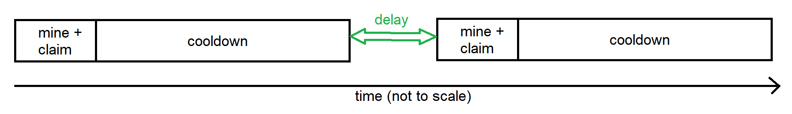
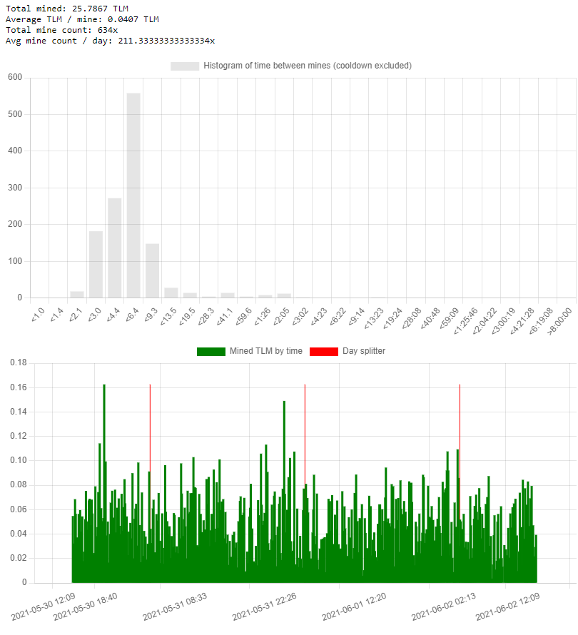

# Check some nice statistics of any miner on Alien Worlds
Download all files, place them in the same repository.  
Double click on 'minerStats.html' it will open the page in your default browser.

Fill in the desired miner name, and set the time it shall go back in time.
The time to 'look back' shall be greater than 0, can have also a decimal place(s), for example 1.23.

Press the 'Go' button and wait for result. Depending on the result size (max 5000 items) and the connection you have it might take up to 10s to process.
After pressing the button the javascript makes a request to alienworlds API -> https://github.com/Alien-Worlds/alienworlds-api  
The javascript reads the response and filters out the relevant data. \
The 2 main thing are the histogram of mine delays, and the amount mined. Both can be used to detect botting.

The mine delay is defined as the time between the moment of the cooldown just elapsed and the next mine:

Bots usually have an almost consistent really short delay (seconds). So you will see a thin spike. \
People on the other hand will have delay from minutes to hours, and most importantly they will have the last bar '> 8:00:00' (bigger than 8 hours) populated (as people do sleep). \
The second chart lists the mined TLM amount in time (green bars). The red bars are the day splitters, drawn on the 23:59 - 00:00 boundary of the day (server time) 
In here you can also spot bots, as they (probably) running without stop.  

On a top of it you will get some other statistics as: total of mined TLM, average of mined TLM, etc. \
**BEWARE** all the dates and times are in server time (UTC) not your local time! 

Last but not least, if you find this tool useful consider a small tip to os2ro.wam

## Example of a human:

## Example of a bot:

